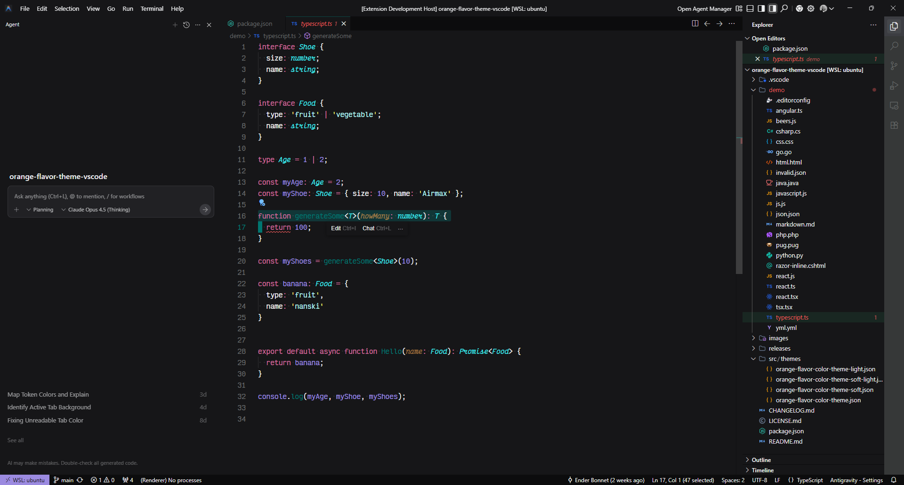
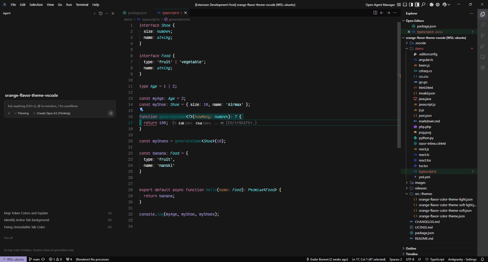

<div align="center">
<h1>Lilo Theme for Visual Studio Code</h1>

[](https://marketplace.visualstudio.com/items?itemName=enbonnet.lilo-theme)
[](https://open-vsx.org/extension/enBonnet/lilo-theme)
[](https://marketplace.visualstudio.com/items?itemName=enbonnet.lilo-theme)


</div>

## Table of Contents

- [Features](#features)
- [Preview](#preview)
- [Color Palette](#color-palette)
- [UI Variants](#ui-variants)
- [ANSI Terminal Colors](#ansi-terminal-colors)
- [Supported Languages](#supported-languages)
- [Installation](#installation)
- [Using the Theme](#using-the-theme)
- [Recommended Settings](#recommended-settings)
- [Development](#development)
- [Contributing](#contributing)
- [Credits](#credits)
- [License](#license)

## Features

- **Two Variants** &mdash; Standard for vibrant contrast and Soft for reduced eye strain during long coding sessions
- **Semantic Highlighting** &mdash; Explicit TextMate scoping rules for 25+ languages including TypeScript, Rust, Go, GraphQL, and more
- **Tropical Teal Palette** &mdash; Warm gold accents with teal, magenta, and violet syntax colors derived from the Lilo brand
- **Thoughtful Contrast** &mdash; Carefully balanced background layers from near-black `#0c0c0d` to hover-state `#545656`
- **Eye Comfort** &mdash; Optimized selection transparency, bracket pair colorization, and muted comments for distraction-free focus

## Preview

### Base Theme
<div align="center">

</div>

### Soft Variant
<div align="center">

</div>

## Color Palette

| Role | Color | Hex | Preview |
|------|-------|-----|---------|
| Background | Near Black | `#161618` |  |
| Foreground | Off White | `#eff0f2` |  |
| Selection | Teal Selection | `#009a9c3d` |  |
| Comments | Muted Gray | `#676a6a` |  |
| Cyan | Cyan Highlight | `#3de5e8` |  |
| Green | Deep Teal | `#007670` |  |
| Orange | Warm Gold | `#E89B4C` |  |
| Pink | Magenta | `#D06B9F` |  |
| Purple | Soft Violet | `#9B8AE0` |  |
| Red | Error Red | `#E85757` |  |
| Yellow | Mint Tint | `#b2f5f3` |  |

## UI Variants

| Variable | Hex | Purpose |
|----------|-----|---------|
| BGDarker | `#0c0c0d` | Title bar, status bar, tab container |
| BGDark | `#161618` | Side bar, editor widgets, peek view results |
| BG | `#161618` | Main editor, panel, breadcrumbs |
| BGLight | `#363838` | Activity bar, dropdowns, list filter widget |
| BGLighter | `#545656` | Selection highlights, hover feedback |

## ANSI Terminal Colors

| ANSI | Name | Normal | Bright |
|------|------|--------|--------|
| 0/8 | Black | `#161618` | `#676a6a` |
| 1/9 | Red | `#E85757` | `#F07070` |
| 2/10 | Green | `#00afb4` | `#00c5ce` |
| 3/11 | Yellow | `#E8C857` | `#F0D870` |
| 4/12 | Blue | `#9B8AE0` | `#B0A0F0` |
| 5/13 | Magenta | `#D06B9F` | `#E080B0` |
| 6/14 | Cyan | `#3de5e8` | `#7beeee` |
| 7/15 | White | `#eff0f2` | `#f1f3f5` |

## Supported Languages

This theme provides explicit TextMate scoping rules for the following languages. Additional languages are covered by general-purpose syntax scoping.

| Language | TextMate Scoping Rules |
|----------|----------------------|
| C | `storage.type.c` |
| C# | `keyword.type.cs`, `storage.type.cs` |
| CoffeeScript | `meta.variable.assignment.destructured.object.coffee` |
| CSS / Less / Stylus | `entity.other.attribute-name`, `entity.other.attribute-name.parent-selector`, `meta.selector` |
| Go | `source.go storage.type` |
| GraphQL | `meta.selectionset.graphql`, `entity.name.fragment.graphql`, `meta.arguments.graphql` |
| Groovy | `meta.method.groovy`, `keyword.operator.navigation.groovy`, `storage.type.groovy` |
| Haskell | `storage.type.haskell`, `meta.preprocessor.haskell`, `constant.language.empty-list.haskell` |
| HTML | `entity.name.tag`, `entity.other.attribute-name` |
| Java | `meta.method-call.java`, `keyword.operator.dereference.java`, `storage.type.java` |
| JavaScript / JSX | `variable.other.constant.js`, `punctuation.section.embedded.jsx` |
| Log files | `log.error`, `log.warning` |
| Lua | `support.function.any-method.lua` |
| Makefile | `entity.name.function.target.makefile`, `meta.scope.prerequisites.makefile` |
| Markdown | `markup.heading`, `markup.bold`, `markup.italic`, `markup.quote`, `markup.inline.raw`, `fenced_code.block.language`, `meta.separator.markdown` |
| Objective-C | `storage.type.objc`, `meta.implementation storage.type.objc`, `meta.protocol-list.objc`, `meta.return-type.objc` |
| OCaml | `storage.type.ocaml` |
| Perl | `constant.other.key.perl` |
| PHP | `meta.function-call.php`, `storage.type.php`, `variable.other.php` |
| PowerShell | `source.powershell entity.other.attribute-name`, `support.constant`, `keyword.operator.other.powershell` |
| Python | `string.quoted.docstring.multi.python` |
| Ruby | `variable.other.readwrite.instance.ruby`, `constant.other.symbol.hashkey.ruby` |
| Rust | `storage.class.std.rust`, `storage.type.core.rust` |
| SCSS | `meta.attribute-selector.scss`, `meta.at-rule.function`, `meta.at-rule.mixin` |
| Shell | `source.shell variable.other`, `meta.scope.for-loop.shell` |
| Swift | `keyword.expressions-and-types.swift`, `keyword.primitive-datatypes.swift`, `storage.type.attribute.swift` |
| TOML | `entity.name.section.toml`, `variable.other.key.toml`, `constant.other.date` |
| TypeScript / TSX | `variable.other.constant.ts`, `variable.other.constant.tsx`, `punctuation.section.embedded.tsx` |
| YAML | `entity.name.tag.yaml`, `variable.other.alias.yaml` |

> Languages not listed above are covered by general-purpose scoping rules for comments, strings, keywords, functions, types, variables, constants, and punctuation.

## Installation

### VS Code Marketplace
[](https://marketplace.visualstudio.com/items?itemName=enbonnet.lilo-theme)

### Open VSX Registry
[](https://open-vsx.org/extension/enBonnet/lilo-theme)

## Using the Theme

1. Open the Command Palette (`Ctrl+Shift+P` or `Cmd+Shift+P`)
2. Type "Preferences: Color Theme" and press Enter
3. Search for "Lilo Theme"
4. Select "Lilo Theme" or "Lilo Theme (Soft)" from the list

## Recommended Settings

For the best experience, add these to your `settings.json`:

```json
{
  "workbench.colorTheme": "Lilo Theme",
  "editor.fontFamily": "'Victor Mono', Monaco, Menlo, 'Courier New', monospace",
  "editor.fontSize": 16,
  "editor.lineHeight": 1.5,
  "editor.fontWeight": "600",
  "editor.wordWrap": "on"
}
```

> Recommended font: [Victor Mono](https://rubjo.github.io/victor-mono/)

## Development

### Prerequisites

- [Node.js](https://nodejs.org/) (v18+)
- [pnpm](https://pnpm.io/) or npm

### Setup

```bash
pnpm install
pnpm run build
pnpm run package
```

### Project Structure

```
lilo-theme-vscode/
├── src/
│   └── lilo.yml           # Theme source (YAML)
├── theme/
│   ├── lilo.json          # Generated base theme
│   └── lilo-soft.json     # Generated soft variant
├── scripts/
│   ├── build.js           # Build entry point
│   ├── generate.js        # YAML parser & soft variant generator
│   └── lint.js            # Theme linter
├── docs/                  # Static landing site
│   ├── index.html
│   ├── languages.html
│   └── css/
│       └── style.css
└── images/
    ├── icon.png
    └── screenshots/
        ├── base.png
        └── soft.png
```

## Contributing

Contributions are welcome! If you find any issues or have suggestions for improvements, please feel free to:

1. Open an [issue](https://github.com/enbonnet/lilo-theme-vscode/issues)
2. Submit a pull request
3. Share your feedback

For updates, star this repository and follow me on [GitHub](https://github.com/enbonnet).

## Credits

- Inspired by the [Lilo](https://lilohq.com/) brand colors and tropical design aesthetic
- Based on the [Dracula Theme](https://draculatheme.com/) schema, with colors adapted from the Lilo brand palette
- Special thanks to all contributors and the VS Code community

## License

This project is licensed under the MIT License &mdash; see the [LICENSE](LICENSE) file for details.

---

<div align="center">
Made with 🖤 by <a href="https://enbonnet.com">Ender Bonnet</a>
</div>
